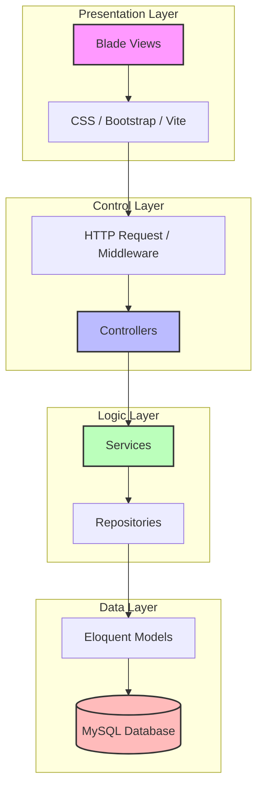
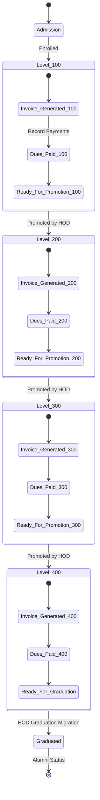

# HTU COMPSSA Student Finance Management System (SFMS)

[](https://laravel.com)
[](https://www.php.net)
[](https://www.mysql.com)
[](https://getbootstrap.com)

A modern Laravel-based web application designed to manage departmental dues, student records, academic progression, invoices, payments, receipts, reporting, and user management for the Ho Technical University Computer Science Students Association (COMPSSA).

The system provides a secure, scalable, and user-friendly platform for administrators, Heads of Department, finance officers, auditors, and students to efficiently manage departmental financial operations throughout the students' academic journey.

---

## Table of Contents

- [Overview](#overview)
- [Project Objectives](#project-objectives)
- [System Architecture](#system-architecture)
- [Student Academic Lifecycle](#student-academic-lifecycle)
- [Key Features](#key-features)
- [User Roles & Permissions](#user-roles--permissions)
- [Technology Stack](#technology-stack)
- [Project Structure](#project-structure)
- [Installation & Setup](#installation--setup)
- [Default Accounts](#default-accounts)
- [Security Features](#security-features)
- [Development Roadmap](#development-roadmap)
- [Future Improvements](#future-improvements)
- [License & Authors](#license--authors)

---

## Overview

Managing departmental dues manually often results in lost payment records, duplicate receipts, difficulty tracking outstanding balances, poor reporting, and a lack of transparency. The **Student Finance Management System (SFMS)** automates these workflows, offering a centralized platform that reduces administrative overhead and improves financial accountability.

---

## Project Objectives

- **Digitize Dues Management:** Eliminate manual paper-based processes.
- **Track Outstanding Balances:** Maintain up-to-date statements of accounts for all students.
- **Ensure Financial Transparency:** Provide audit logs and real-time revenue collection reports.
- **Automate Promotion Progression:** Facilitate easy promotion of students into new academic levels at the end of each year.
- **Dynamic Receipt Verification:** Generate PDF receipts featuring verification codes and QR codes.

---

## System Architecture

SFMS follows the standard Laravel MVC (Model-View-Controller) design pattern. The application layer communicates through a clear separation of concerns:



---

## Student Academic Lifecycle

Students migrate through different levels of the academic lifecycle, managed systematically by the Promotion Module:



---

## Key Features

### 🔐 Authentication & Security
- Secure credentials-based login utilizing Laravel Breeze.
- Secure password hashing and protection mechanisms.
- Dynamic route middleware preventing unauthorized page views.
- System-wide security configurations including CSRF and XSS protections.

### 👥 Student Management
- Bulk upload capability via **CSV and Excel import** to quickly register students.
- Searchable directory of students by level, name, and programme.
- Detailed academic profiles including historical records of dues and payments.

### 📅 Academic Session & Levels Management
- Flexible academic session control (e.g., active session `2024/2025`, `2025/2026`).
- Automatic management of levels (Level 100, 200, 300, 400).
- Lockout parameters restricting operations on inactive sessions.

### 🚀 Student Promotion (Academic Migration)
- Promotes eligible cohorts of students to the next level in a single action.
- Comprehensive pre-promotion verification (balances check, eligibility review).
- Automated invoice generation for the new academic level upon promotion.
- Full promotion activity logged historically.

### 💳 Dues & Invoice System
- Flexible dues templates (define amounts by Level, Programme, and Session).
- Auto-generation of invoices for all active student accounts.
- Split invoice lines supporting multi-category dues (e.g., Association Fee, Project Fee).

### 🧾 Payments & Receipts
- Records full, partial, or split-mode payments.
- Support for multiple payment methods: **Cash, Mobile Money, and Bank Transfer**.
- Instant PDF receipt generator including verification codes and QR codes for authentication.
- Payment reversal workflow with secure auditing.

### 📊 Reports & Analytics
- Live dashboard displaying revenue collection metrics.
- Visual progression charts (Monthly Collection, Collections by Level/Programme).
- Single-click export of financial reports into PDF, CSV, and Excel spreadsheets.

---

## User Roles & Permissions

| Role | Access Level | Primary Responsibilities |
| :--- | :--- | :--- |
| **Head of Department (HOD)** | **Full System Access** | Manage user accounts, configure sessions & dues, run Student Promotion, view all reports, audit logs, and settings. |
| **Finance Officer** | **Financial Access** | Create invoices, record student payments, issue and print receipts, reverse transactions, and view basic dashboards. |
| **Auditor** | **Read-Only Access** | Access payment records, view audit logs, and generate financial reports. No create, edit, or delete permissions. |
| **Student** | **Portal Access** | Log in to personal profile, view outstanding dues/invoices, download receipts, and simulate payment gateways. |

---

## Technology Stack

### Core Technologies
- **PHP 8.3+** (Runtime Environment)
- **Laravel 12.x** (MVC Framework)
- **MySQL 8.0+** (Database Management System)
- **Bootstrap 5 & Blade Templates** (Frontend Styling & Render Engine)

### Key Packages
- **Spatie Laravel Permission** - Robust Role-Based Access Control (RBAC)
- **Laravel Breeze** - Secure frontend authentication boilerplate
- **Laravel DomPDF** - PDF rendering for receipts and reports
- **Maatwebsite Excel** - CSV and spreadsheet data import/export workflows
- **Chart.js** - Dynamic dashboards and graphical analytics charts

---

## Project Structure

```text
app/
 ├── Http/            # Controllers, Request Validation, Middleware
 ├── Models/          # Eloquent Database Models
 ├── Services/        # Business Logic Layers
 ├── Repositories/    # Data Access Layer Abstractions
 ├── Notifications/   # Application Notifications (Email/Database)
 └── Policies/        # Authorization Policies
database/
 ├── migrations/      # Database Migrations
 └── seeders/         # Default Data and User Seeders
resources/
 ├── views/           # Blade Layouts and Component Templates
 └── css/js/          # Vite-compiled asset files
routes/
 └── web.php          # Application Routes & Middleware groups
```

---

## Installation & Setup

### Prerequisites
Make sure your development machine has the following tools installed:
- PHP 8.3 or higher
- Composer (PHP Dependency Manager)
- Node.js & NPM
- MySQL / MariaDB

### ⚡ Option A: Automated Installation (Recommended)

This project includes customized composer scripts to automate the installation process.

1. **Clone the Repository:**
   ```bash
   git clone https://github.com/username/sfms.git
   cd Departmental-Dues-Management-System
   ```

2. **Run the Setup Script:**
   This command installs dependencies, creates your `.env` file, generates keys, and compiles your assets:
   ```bash
   composer run setup
   ```

3. **Configure Database & Seed:**
   Open the generated `.env` file and set your database connection credentials:
   ```env
   DB_CONNECTION=mysql
   DB_HOST=127.0.0.1
   DB_PORT=3306
   DB_DATABASE=sfms_db
   DB_USERNAME=root
   DB_PASSWORD=
   ```
   After updating `.env`, run migrations and seed data:
   ```bash
   php artisan migrate --seed
   ```

4. **Start the Development Server:**
   This runs the web server, Vite compiler, queue listeners, and logs concurrently:
   ```bash
   composer run dev
   ```

---

### 🛠️ Option B: Manual Installation

If you prefer to configure each step manually, follow these commands:

1. **Install PHP Dependencies:**
   ```bash
   composer install
   ```

2. **Install & Build Assets:**
   ```bash
   npm install
   npm run build
   ```

3. **Environment Setup:**
   ```bash
   cp .env.example .env
   php artisan key:generate
   ```

4. **Run Migrations & Seeders:**
   ```bash
   php artisan migrate
   php artisan db:seed
   ```

5. **Serve the Application:**
   ```bash
   php artisan serve
   ```

---

## Default Accounts

> [!IMPORTANT]
> The database seeder (`DefaultUsersSeeder`) populates the system with three roles pre-configured. Use the credentials below to log in during your presentation or evaluation.

| Role | Username / Email | Password |
| :--- | :--- | :--- |
| **Head of Department (HOD)** | `hod@compssa.edu.gh` | `password` |
| **Finance Officer** | `finance@compssa.edu.gh` | `password` |
| **Student** | `student@htu.edu.gh` | `password` |

---

## Security Features

- **CSRF Protection:** All forms require standard Laravel `@csrf` tokens.
- **XSS & SQL Injection Protection:** Built-in Eloquent query binding and Blade echo-escaping.
- **Audit Logs:** System automatically tracks activities (such as logins, payments posted, student promotions, reversals) detailing who did what, when, and from which IP.
- **Soft Deletes:** Prevents catastrophic data loss by using soft deletes for student and payment history.

---

## Development Roadmap

*   **Phase 1: Foundations**
    *   [x] Database Schemas, Migrations & Core Seeders
    *   [x] Authentication and Middleware configuration
    *   [x] Student directory & CSV importer
*   **Phase 2: Billing & Processing**
    *   [x] Dues definitions & Invoice Generation
    *   [x] Payment Entry & Reversals
    *   [x] DomPDF-generated dynamic receipts with QR validation codes
*   **Phase 3: Promotion & Core Analytics**
    *   [x] Student Promotion/Migration module
    *   [x] System Audit logs
    *   [x] Chart.js Financial dashboards
*   **Phase 4: Optimization & Deployment**
    *   [x] Mobile responsive UI styling
    *   [x] Custom Composer build script pipelines
    *   [x] Presentation-ready documentation

---

## Future Improvements

- **SMS/WhatsApp Gateways:** Send invoice reminders and payment receipts directly to mobile phones.
- **Online Checkout Integration:** Connect Paystack or Mobile Money APIs for live online payments.
- **Predictive Analytics:** Use historical dues collection rates to predict future budgets and collections.
- **Multi-Faculty Architecture:** Expand from COMPSSA to support all student associations and faculties university-wide.

---

## License & Authors

Developed by the **HTU COMPSSA Software Development Team**. 

Licensed under the MIT License - see the LICENSE file for details.
